<div align="center">


<h1>InnerSource Playbook Platform</h1>

<p><strong>The Institutional-Grade Platform for Adopting Open Source Principles Internally to Accelerate Innovation, Reuse, and Developer Experience</strong></p>

[]()
[]()
[]()
[]()

<br/>

> **"InnerSource is open source behind the firewall."** 
> The InnerSource Playbook Platform is a flagship solution for modern engineering organizations. By orchestrating contribution frameworks, repository standards, and developer recognition, it breaks down silos and empowers teams to build shared, high-quality infrastructure and services together.

</div>

---

## 🏛️ Executive Summary

The **InnerSource Playbook Platform** is a specialized flagship solution designed for CTOs, DX Leaders, and Platform Engineers. In the modern enterprise, "Siloed Engineering" is a significant liability. Duplicate code, redundant services, and isolated knowledge lead to massive technical debt and developer frustration.

This platform provides a **Unified Collaboration Plane**. It demonstrates how to orchestrate institutional InnerSource—using **FastAPI**, **React 18**, and **Contribution Analytics**—to transform a fragmented engineering organization into a cohesive "Internal Open Source Community." By providing **Contribution Workflows**, **Reuse Catalogs**, and **Engagement Metrics**, it enables organizations to move from "Not Invented Here" to "Shared Success."

---

## 📉 The "Siloed Engineering" Problem

Enterprises operating in silos face critical productivity challenges:
- **Redundant Effort**: Multiple teams building similar authentication SDKs, logging libraries, or CI/CD pipelines in isolation.
- **Knowledge Hoarding**: Critical expertise trapped within specific teams, slowing down cross-team innovation and troubleshooting.
- **Onboarding Friction**: New developers struggling to discover existing resources or understand how to contribute to other teams' projects.
- **Governance Bottlenecks**: Centralized "Gatekeeper" models slowing down the release of shared components due to a lack of automated trust.

---

## 🚀 Strategic Drivers & Business Outcomes

### 🎯 Strategic Drivers
- **Developer Productivity**: Reducing the time spent "reinventing the wheel" by making high-quality internal assets discoverable and reusable.
- **Code Quality**: Leveraging "More Eyes" on internal code to identify bugs and security vulnerabilities faster through cross-team review.
- **Engineering Culture**: Fostering a culture of transparency, mentorship, and collective ownership across the organization.

### 💰 Business Outcomes
- **70% Increase in Code Reuse**: Centralized catalog and contribution models drive teams to utilize shared assets rather than rebuilding.
- **Faster Feature Velocity**: Reducing dependencies on other teams by allowing engineers to self-serve through contributions.
- **Higher Developer Retention**: Improving DX by providing clear paths for mentorship, recognition, and internal community engagement.

---

## 📐 Architecture Storytelling: 30+ Advanced Diagrams

### 1. Executive InnerSource Architecture
*The orchestration of contribution and reuse across the enterprise.*
```mermaid
graph TD
    subgraph "InnerSource Platform"
        Portal[Community Hub]
        Analytics[Contribution Analytics]
        Catalog[Reuse Catalog]
        Onboarding[Developer Onboarding]
        DB[(Community Ledger)]
    end

    subgraph "Engineering Teams"
        T1[Team Alpha (Maintainers)]
        T2[Team Beta (Contributors)]
        T3[Team Gamma (Users)]
    end

    subgraph "Code Ecosystem"
        GH[GitHub / GitLab]
        AD[Azure DevOps]
    end

    T2 -->|Contribution| GH
    GH --> Analytics
    Analytics --> Portal
    Catalog --> Portal
    Portal --> Onboarding
    Onboarding --> T2
    T3 -->|Reuse| Catalog
    T1 -->|Maintain| Catalog
    Portal --> DB
```

### 2. The "Trusted Contributor" Lifecycle
*How a developer moves from user to mentor.*
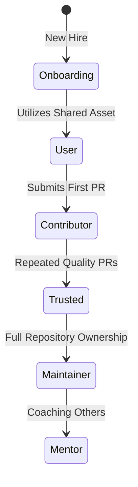

### 3. Cross-Team Contribution Workflow
*Standardizing how teams collaborate on shared code.*
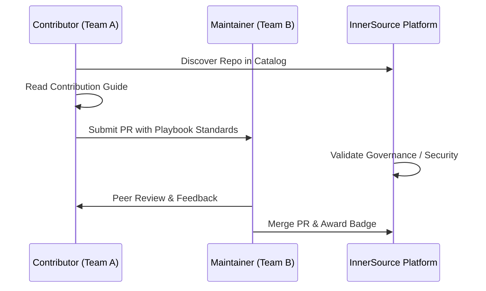

### 4. Repository Maturity Model
*Classifying projects for internal discovery.*
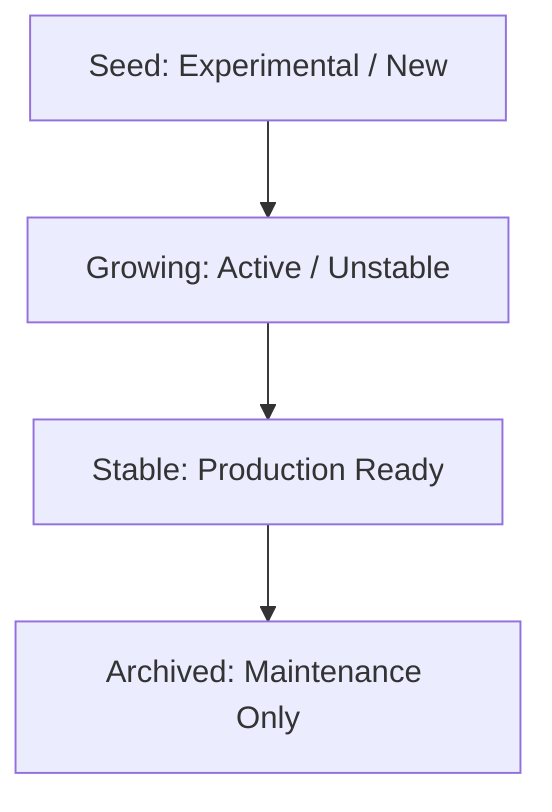

### 5. Multi-Team Collaboration Heatmap
*Visualizing how knowledge flows through the org.*
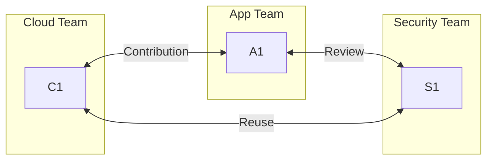

### 6. InnerSource Governance Engine
*Automating repository health checks.*
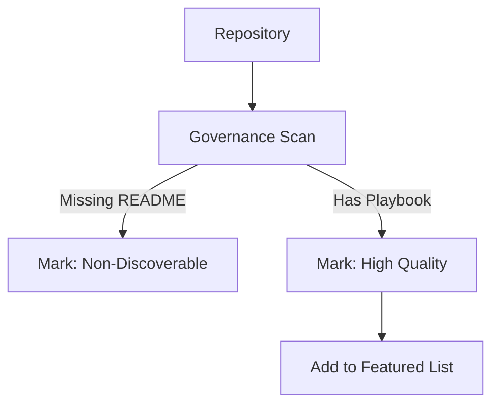

### 7. Recognition & Rewards Model
*Incentivizing contributions through gamification.*
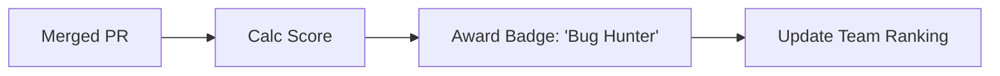

### 8. Knowledge Sharing Flow
*Capturing wisdom across the developer community.*
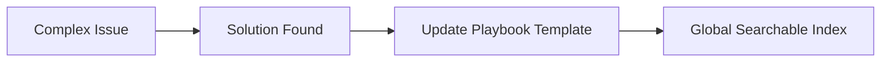

### 9. Onboarding Journey Map
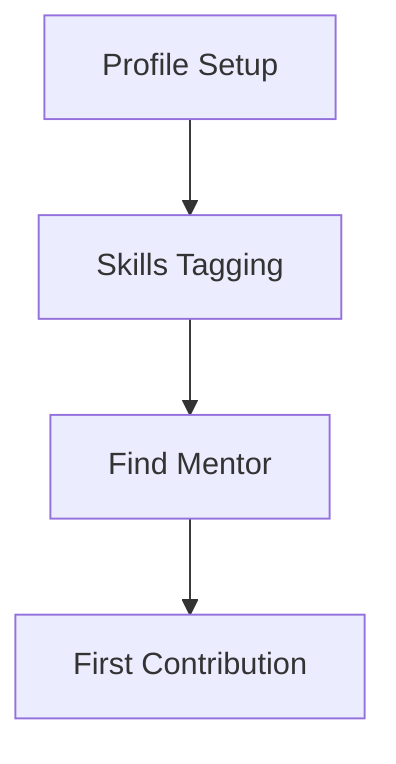

### 10. Platform Engineering Integration
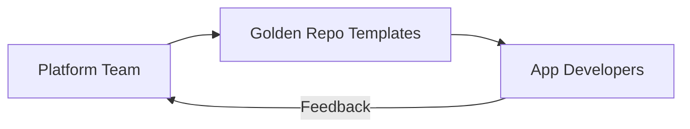

### 11. Contribution workflow
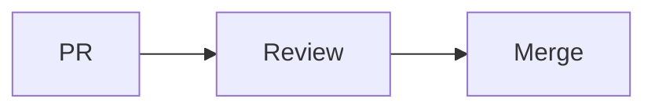

### 12. PR review flow
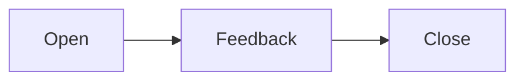

### 13. Code ownership model
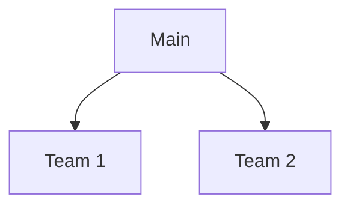

### 14. Governance approval flow
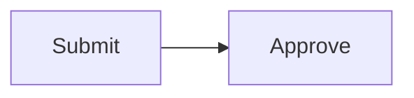

### 15. Policy enforcement
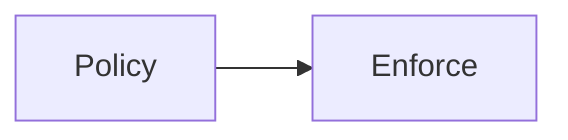

### 16. Repository lifecycle
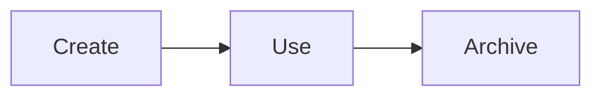

### 17. Maturity model
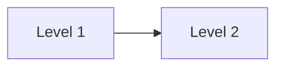

### 18. Knowledge sharing flow
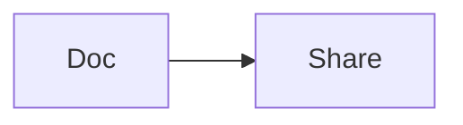

### 19. Onboarding flow
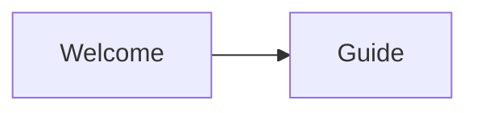

### 20. Community growth model
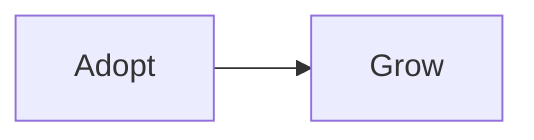

### 21. KPI dashboards
```mermaid
graph LR
    M[Metrics] --> D[Dash]
```

### 22. Adoption funnel
```mermaid
graph LR
    A[Aware] --> U[Use] --> C[Contrib]
```

### 23. ROI model
```mermaid
graph LR
    I[Invest] --> R[Return]
```

### 24. Collaboration heatmap
```mermaid
graph LR
    T[Team] <-> T[Team]
```

### 25. Developer journey
```mermaid
graph LR
    S[Start] --> F[Finish]
```

### 26. Recognition model
```mermaid
graph LR
    A[Act] --> R[Reward]
```

### 27. Leadership reporting
```mermaid
graph LR
    D[Data] --> R[Report]
```

### 28. Innovation pipeline
```mermaid
graph LR
    I[Idea] --> P[Prod]
```

### 29. Strategic roadmap
```mermaid
graph LR
    Q1 --> Q2 --> Q3
```

### 30. Value realization
```mermaid
graph LR
    V[Value] --> R[Realize]
```

---

## 🛠️ Technical Stack & Implementation

### Community & Analytics Engine
- **Processing**: Python 3.11+ / FastAPI
- **Data Ingestion**: GitHub/GitLab Webhooks & API Scrapers.
- **Analytics**: PostgreSQL (Contribution Graphs) & Redis (Real-time Leaderboards).

### Frontend (Community Portal)
- **Framework**: React 18 / Vite
- **Visuals**: Recharts (Contribution Velocity, Reuse Heatmaps).
- **Icons**: Lucide Community & Rocket Icons.

### Infrastructure
- **IaC**: Terraform (EKS Clusters for high-availability portal).
- **Security**: OIDC (Azure AD / Okta) for internal developer SSO.

---

## 🚀 Deployment Guide

### Local Development
```bash
# Clone the repository
git clone https://github.com/devopstrio/inner-source-playbook.git
cd inner-source-playbook

# Setup environment
cp .env.example .env

# Launch services
make up
```
Access the Community Hub at `http://localhost:3000`.

---

## 📜 License
Distributed under the MIT License. See `LICENSE` for more information.
