<div align="center">


<h1>InnerSource Playbook</h1>

<p><strong>The Institutional-Grade Platform for Adopting Open Source Principles Internally to Accelerate Innovation, Reuse, and Developer Experience.</strong></p>

[]()
[]()
[]()

<br/>

> **"InnerSource is open source behind the firewall."** 
> **InnerSource Playbook** is an enterprise-grade platform designed to provide a secure, measurable, and highly automated foundation for global collaboration operations. It orchestrates the complex lifecycle of internal code sharing—from "Golden Path" component discovery and multi-team contribution quorums to distributed maintainer synchronization and unified collaboration governance.

</div>

---

## 🏛️ Executive Summary

Fragmented engineering silos and manual code sharing processes are strategic operational liabilities; lack of centralized collaboration orchestration is a primary barrier to organizational digital agility. Organizations fail to achieve rapid software delivery not because of a lack of engineering talent, but because of fragmented code standards, lack of automated contribution validation, and an inability to orchestrate inner source landing zones with operational precision.

This platform provides the **Collaborative Intelligence Plane**. It implements a complete **Enterprise InnerSource-as-Code Framework**, enabling Engineering and Platform teams to manage global code assets as first-class citizens. By automating the identification of reusable components through real-time repository analysis and orchestrating cross-team contribution workflows, we ensure that every organizational asset—from critical security SDKs to routine UI libraries—is discoverable by default, audited for history, and strictly aligned with institutional collaboration frameworks.

---

## 📐 Architecture Storytelling: Principal Reference Models

### 1. Principal Architecture: Global Inner Source & Collaborative Intelligence Plane
This diagram illustrates the end-to-end flow from component discovery and contribution quorums to automated review, maintainer synchronization, and institutional collaboration auditing.

```mermaid
graph LR
    %% Subgraph Definitions
    subgraph ContributionIngress["Developer & Contributor Ingress"]
        direction TB
        ProjectMaintainers["Core Project Owners"]
        CrossTeamContribs["Internal Guest Contributors"]
        ComponentConsumers["Component Reuse Users"]
    end

    subgraph IntelligenceEngine["Collaborative Intelligence Hub"]
        direction TB
        API["FastAPI Collaboration Gateway"]
        ReviewEngine["Automated Code Reviewer"]
        MaintainerOrch["Maintainer & Review Orch"]
        ComponentCatalog["Global Reuse Catalog Hub"]
    end

    subgraph OperationsPlane["Distributed Collaboration Fleet"]
        direction TB
        ComplianceNodes["Code Standard Validators"]
        QualityDetectors["AIOps Pattern Scanners"]
        RepoSync["Repository Lifecycle Sync"]
    end

    subgraph OperationsHub["Institutional Collaboration Hub"]
        direction TB
        Scorecard["InnerSource Maturity Score"]
        Analytics["Contribution & Reuse Stats"]
        Audit["Forensic Collaboration Metadata Lake"]
    end

    subgraph DevOps["InnerSource-as-Code Framework"]
        direction TB
        TF["Terraform Collaboration Modules"]
        StandardsBot["Code Standard Enforcer"]
        ChatOps["Review Approval Hub"]
    end

    %% Flow Arrows
    ContributionIngress -->|1. Submit Contribution/Order| API
    API -->|2. Search Catalog| ComponentCatalog
    ComponentCatalog -->|3. Evaluate PR| ReviewEngine
    ReviewEngine -->|4. Orchestrate Review| MaintainerOrch
    
    MaintainerOrch -->|5. Execute Validation| OperationsPlane
    OperationsPlane -->|6. Notify Status| ChatOps
    API -->|7. Visualize Health| Scorecard
    
    Scorecard -->|8. Track Velocity| Analytics
    Scorecard -->|9. Record Interaction| Audit
    
    TF -->|10. Provision Hub| IntelligenceEngine
    StandardsBot -->|11. Inject Standards| ReviewEngine
    Audit -->|12. Improve Quality| ComplianceNodes

    %% Styling
    classDef ingress fill:#f5f5f5,stroke:#616161,stroke-width:2px;
    classDef intel fill:#ede7f6,stroke:#311b92,stroke-width:2px;
    classDef operations fill:#e1f5fe,stroke:#01579b,stroke-width:2px;
    classDef ops fill:#e8f5e9,stroke:#1b5e20,stroke-width:2px;
    classDef devops fill:#fffde7,stroke:#f57f17,stroke-width:2px;

    class ContributionIngress ingress;
    class IntelligenceEngine intel;
    class OperationsPlane operations;
    class OperationsHub ops;
    class DevOps devops;
```

### 2. The Inner Source Lifecycle Flow
The continuous path of a shared asset from initial discovery in the library and contribution (PR) to active review, maintainer merging, reuse, and institutional forensic auditing.

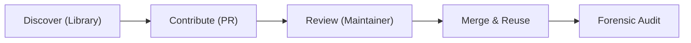

### 3. Collaborative Contribution Topology
Orchestrating the high-integrity flow from internal developers across different business units into a unified source hub, providing a unified institutional view of engineering collaboration.

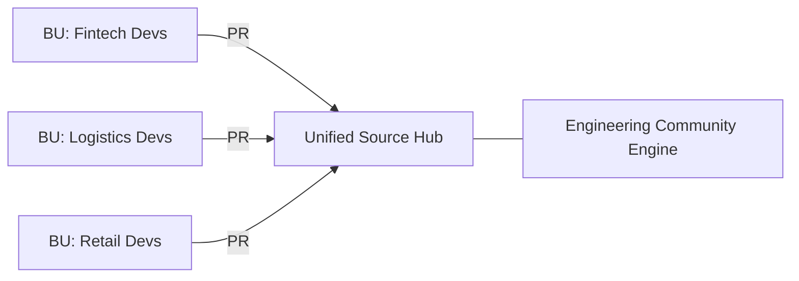

### 4. Distributed Maintainer & Contributor Interaction Flow
Managing the secure integration of guest contributors with core project maintainers, ensuring institutional code quality, knowledge sharing, and peer review accountability.

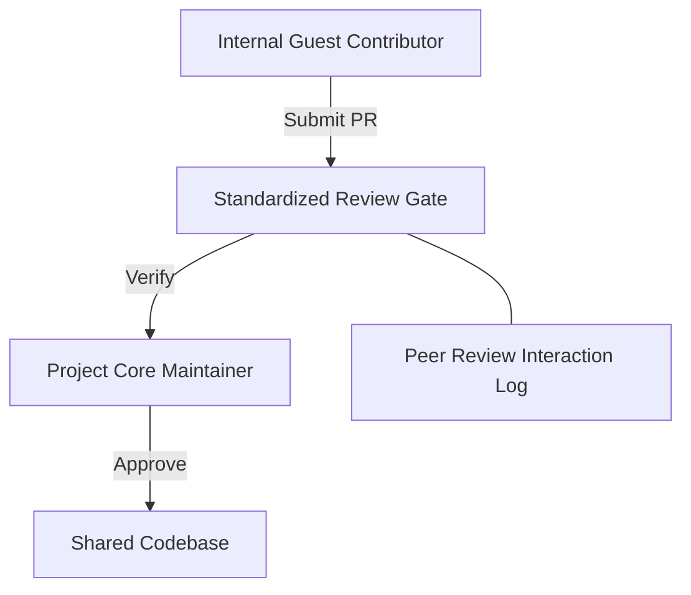

### 5. Multi-Entity Component Federation & Sync Flow
Strategically aggregating and synchronizing reusable components across global geographic clusters (EMEA, APAC, AMER), ensuring high-availability asset discovery and local compliance.

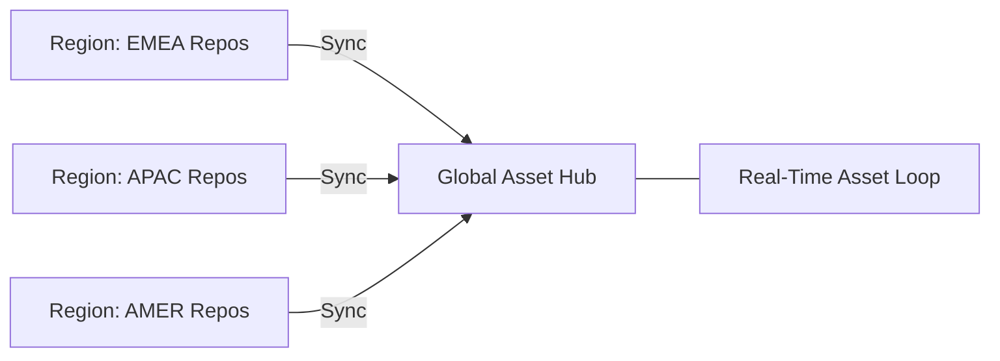

### 6. Inner Source Governance & Quality Guardrails Flow
Automatically enforcing industry-specific code standards and documentation requirements—including security linting and licensing—directly via policy-as-code, ensuring organizational audit readiness.

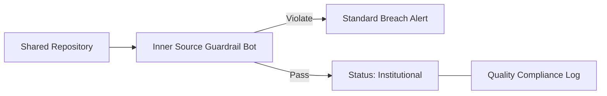

### 7. Institutional Inner Source Maturity Scorecard
Grading organizational performance based on key indicators: Contribution Participation Rate, Component Reuse Ratio, and Maintainer Responsiveness Index.

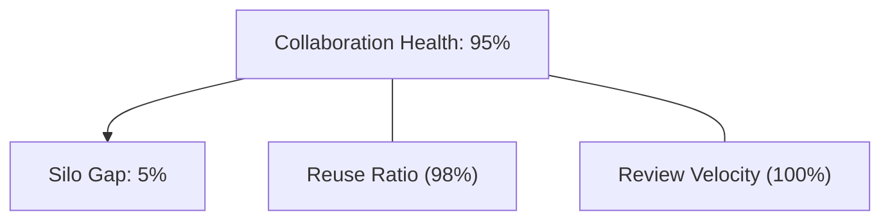

### 8. Identity & RBAC for Inner Source Governance
Managing fine-grained access to shared codebases, contribution triggers, and audit logs between Project Maintainers, Contributors, Consumers, and Auditors.

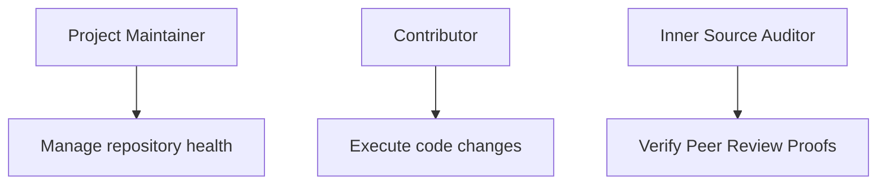

### 9. IaC Deployment: InnerSource-as-Code Framework
Using modular Terraform to deploy and manage the versioned distribution of the collaboration tracking hubs, quality workers, and forensic metadata lakes.

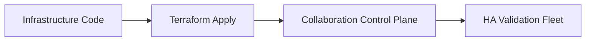

### 10. AIOps Contribution Anomaly & Risk Validation Flow
Using advanced analytics to identify suspicious code patterns, sudden drops in contribution volume, or potential IP leakage that could result in institutional risk.

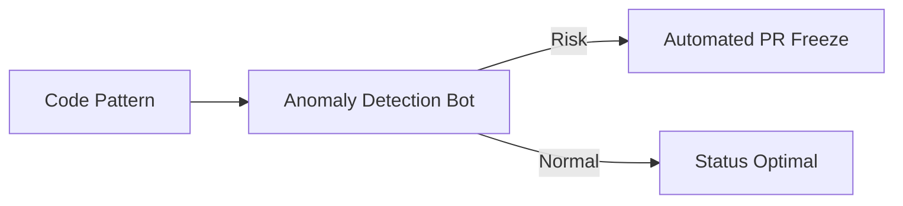

### 11. Metadata Lake for Forensic Inner Source Audit
Storing long-term records of every contribution made, every reuse event recorded, and every maintainer action for institutional record-keeping, compliance auditing, and post-collaboration forensics.

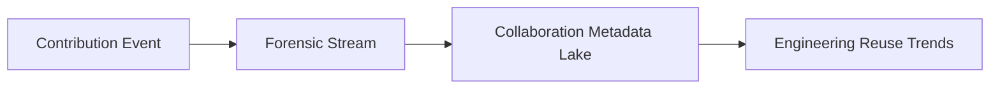

---

## 🏛️ Core Collaboration Pillars

1.  **Unified Source Coordination**: Maximizing velocity by centralizing all code collaboration through a single institutional plane.
2.  **Automated Quality Validation**: Eliminating "fragile code" through proactive linting and security verification.
3.  **Sequential Review Intelligence**: Ensuring zero-interruption merging through dependency-aware peer review quorums.
4.  **Zero-Trust Identity Protection**: Automatically enforcing maintainer quorums and identity-based access across all shared repositories.
5.  **Autonomous Governance Logic**: Guaranteeing compliance through automated industry-specific documentation runbooks.
6.  **Full Collaboration Auditability**: Immutable recording of every PR and maintainer decision for institutional forensics.

---

## 🛠️ Technical Stack & Implementation

### Collaboration Engine & APIs
*   **Framework**: Python 3.11+ / FastAPI.
*   **Analytics Hub**: Custom Python-based logic for contribution graphing and reuse modeling.
*   **Connectivity**: Integration with GitHub, GitLab, and Azure DevOps via webhooks and REST APIs.
*   **Persistence**: PostgreSQL (Collaboration Ledger) and Redis (Live PR State).
*   **Auth Orchestrator**: Federated OIDC/SAML for least-privilege collaboration management access.

### Community Portal (UI)
*   **Framework**: React 18 / Vite.
*   **Theme**: Dark, Violet, Slate (Modern high-fidelity developer aesthetic).
*   **Visualization**: D3.js for contribution heatmaps and Recharts for reuse velocity analytics.

### Infrastructure & DevOps
*   **Runtime**: AWS EKS or Azure Kubernetes Service (AKS) for management plane.
*   **Quality Hub**: Managed CI/CD using GitHub Actions and custom review bots.
*   **IaC**: Modular Terraform for deploying the collaboration landing zone and validation fleet.

---

## 🏗️ IaC Mapping (Module Structure)

| Module | Purpose | Real Services |
| :--- | :--- | :--- |
| **`infrastructure/coll_hub`** | Central management plane | EKS, PostgreSQL, Redis |
| **`infrastructure/gateways`** | Secure SCM Webhooks & APIs | API Gateway, WAF |
| **`infrastructure/validation`** | Code Standard & Quality compute | Spark, Python Workers |
| **`infrastructure/auditing`** | Forensic collaboration sinks | S3, Athena, Quicksight |

---

## 🚀 Deployment Guide

### Local Principal Environment
```bash
# Clone the inner source platform
git clone https://github.com/devopstrio/inner-source-playbook.git
cd inner-source-playbook

# Configure environment
cp .env.example .env

# Launch the InnerSource stack
make init

# Trigger a mock contribution ingestion and automated review simulation
make simulate-innersource
```

Access the Community Hub at `http://localhost:3000`.

---

## 📜 License
Distributed under the MIT License. See `LICENSE` for more information.

---
<div align="center">
  <p>© 2026 Devopstrio. All rights reserved.</p>
</div>
