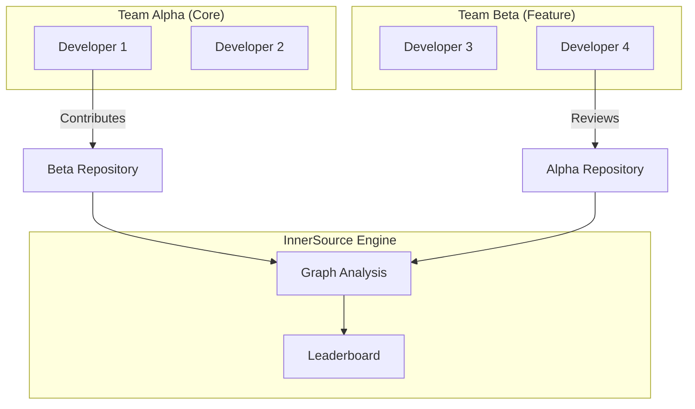
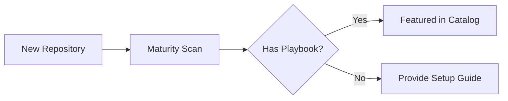
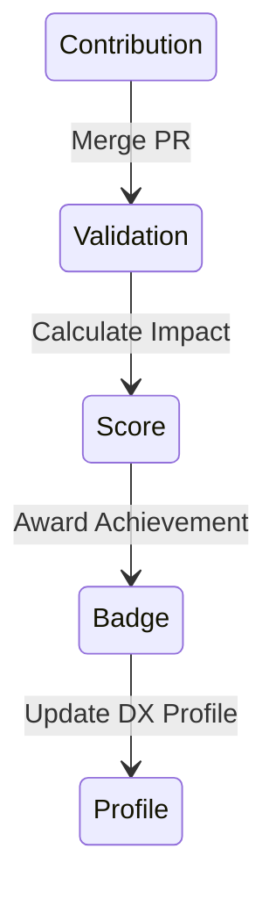

# Architecture & Collaboration Diagrams

## 11. Multi-Team Collaboration Topology (Detailed)
*How the platform maps connections between disparate engineering units.*

## 13. Repository Onboarding Workflow

## 20. Recognition & Reward Cycle

