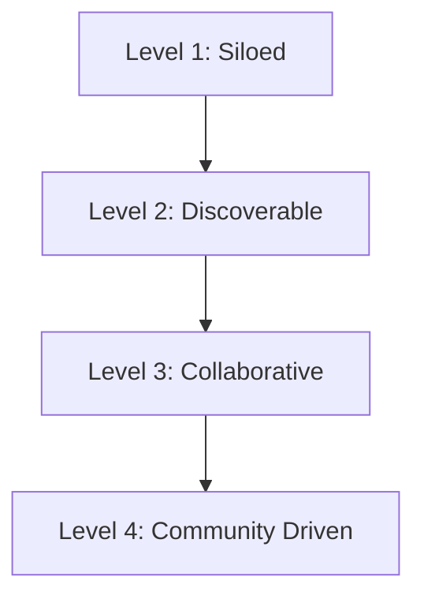
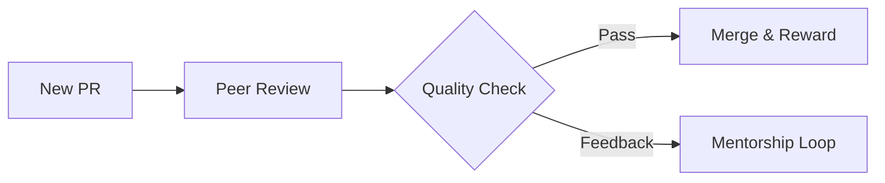
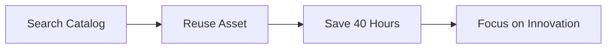

# Governance & DX Diagrams

## 31. InnerSource Maturity Levels

```mermaid
graph TD
    L1[Level 1: Siloed] --> L2[Level 2: Discoverable]
    L2 --> L3[Level 3: Collaborative]
    L3 --> L4[Level 4: Community Driven]
```

## 34. PR Quality Assessment Model

```mermaid
graph LR
    PR[New PR] --> Review[Peer Review]
    Review --> Quality{Quality Check}
    Quality -->|Pass| Merge[Merge & Reward]
    Quality -->|Feedback| Mentor[Mentorship Loop]
```

## 40. Developer Experience (DX) Value Stream

```mermaid
graph LR
    Search[Search Catalog] --> Reuse[Reuse Asset]
    Reuse --> Save[Save 40 Hours]
    Save --> Focus[Focus on Innovation]
```
